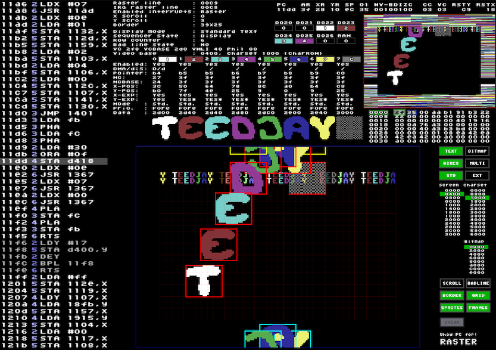

# c64-sprites
KickAss scrolling text and sine sprites for the Commodore 64

## Prerequisites
- [Kick Assembler](http://www.theweb.dk/KickAssembler/)
- [Visual Studio Code](https://code.visualstudio.com)
- [KickAss (C64) plugin by Captain JiNX](https://marketplace.visualstudio.com/items?itemName=CaptainJiNX.kickass-c64)
- [VICE C64 emulator](http://vice-emu.sourceforge.net/)

## How to assemble and run
When you have installed everyting and verified your assembly build chain you should be able to check out this code, open the folder in VSCode, open
the `teedjay.asm` file and select `KickAss (C64): Build and Run` from the `Command Palette`.

## Other Information
- The initialization and the SID player was taken from the KickAss example
- SID tune is [Ode to C64 by Jeff / Søren Lund](https://csdb.dk/sid/?id=15426)

## What does it look like?

